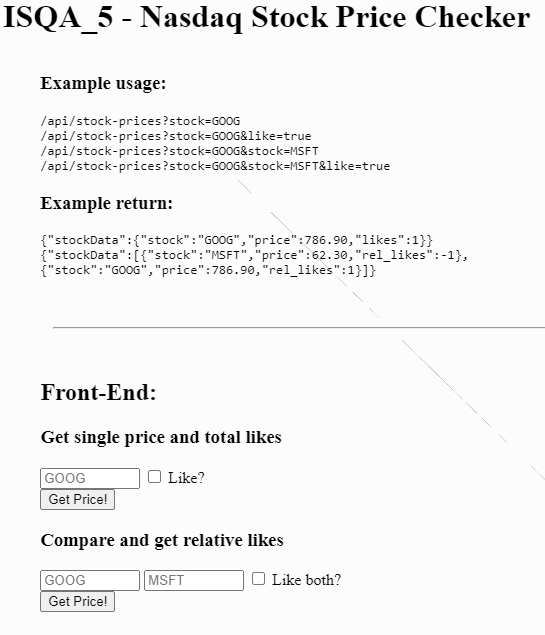

# Stock Price Checker

- This API allows you to get data from stock prices.

- Since this is a backend pactice, the interface is just for testing and provided by FreeCodeCamp.

Technologies used: Javascript, NodeJS

# Live Version



# Running Locally

To run this locally, 
- Set up a MongoDB and update env variable MONGO_URI
- Run the following commands in a terminal:

```
npm install
npm start
```

# Requirements

- You should set the content security policies to only allow loading of scripts and CSS from your server.
- You can send a GET request to /api/stock-prices, passing a NASDAQ stock symbol to a stock query parameter. The returned object will contain a property named stockData.
- The stockData property includes the stock symbol as a string, the price as a number, and likes as a number.
- You can also pass along a like field as true (boolean) to have your like added to the stock(s). Only 1 like per IP should be accepted.
- If you pass along 2 stocks, the returned value will be an array with information about both stocks. Instead of likes, it will display rel_likes (the difference between the likes on both stocks) for both stockData objects.
- All 5 functional tests are complete and passing.